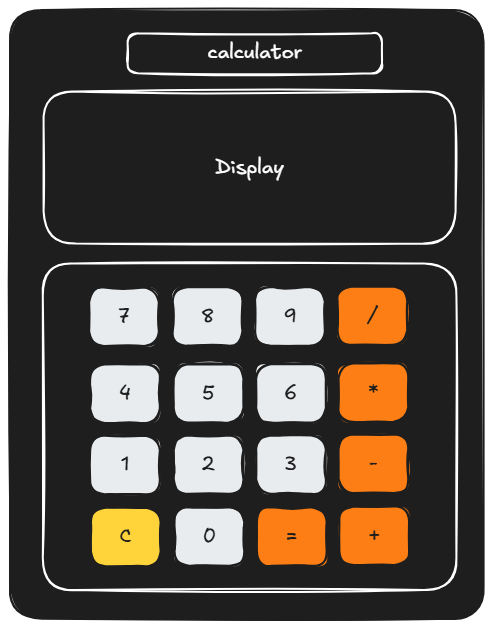
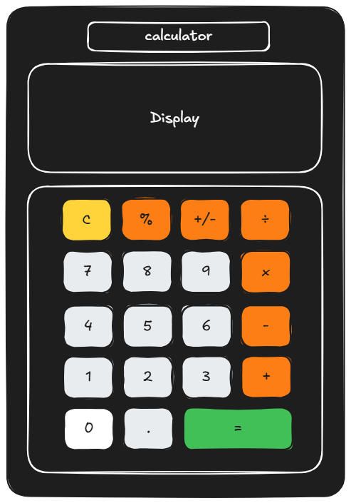

# Design

## Project's design overview

<!-- > Give an overview of your project's design -->

<!-- give an overview of your project's design -->
<!-- describe the reasoning behind your group's design and wireframe -->
<!-- include other centralized decisions like fonts, palates, ... -->

<!-- ## Wireframe(s)

> Include your wireframe(s) and link to wireframe -->

<!-- provide a link to your wireframe documenting on Figma, or wherever it is -->

Version 1:

<https://excalidraw.com/#json=FrtfL3vsFxbxaSvlv-U-r,BQs5v6qiKmg-_UEvcvSg9Q>

Version 2:

<https://excalidraw.com/#json=RJvM0KeCHVcqUahLUFhBo,CwEtHfKt9tuY8Yu8pKlDKQ>

